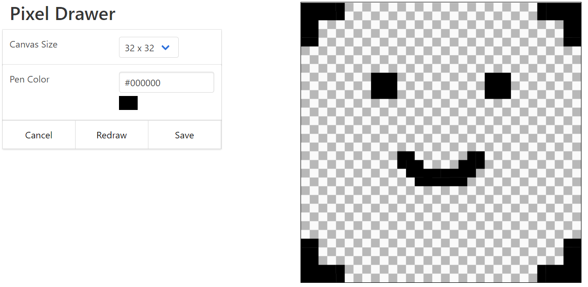
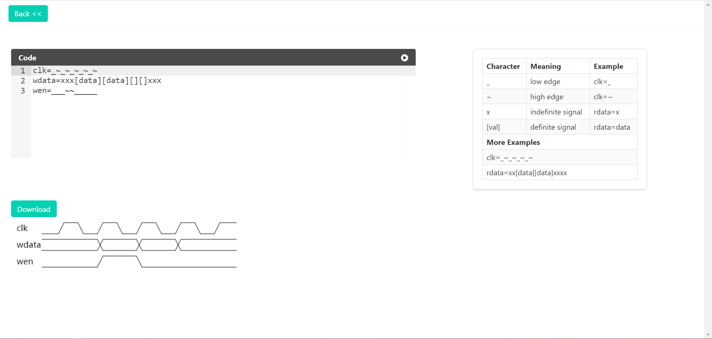

# GADGET

> This repository presents some interesting and useful tools coded by JS, python etc. I develop them in my free time, so they may be not updated in time.

## Pixel Drawer

This tool allows you to "edit" an image pixel by pixel. You can just click your mouse to change the RGB values of every pixel in an image. Right now, the size of canvas supported by this tool 24 * 24 px, 32 * 32 px and 48 * 48 px. You can download the image in PNG format after your work is done. Click the download button, then you will get an image with the size of 32 * 32 px or others.

For example:

result:

Follow this [link](https://silverster98.github.io/gadget/pixel_drawer/index.html), you can use it on your computer.

## Timing Creator

<!-- 正经代码写不了几行，这种乱七八糟的倒是挺乐意写 -->

Use code to create a timing figure usually used in digital circuit design to indicate temporal relation. Just follow the mapping between character and it's meaning, then you can make it. 

Example:

Click the run button, the timing will be drawn according to the code. Click the download button, then the image in PNG format will be downloaded.

Follow this [link](https://silverster98.github.io/gadget/timing_creator/index.html), you can use it on your computer.
